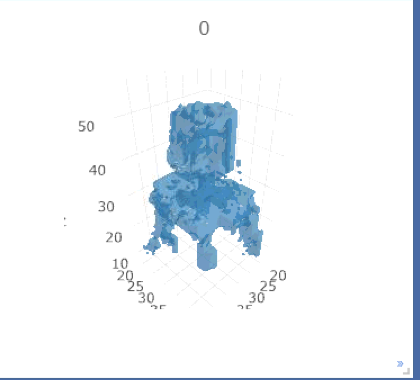
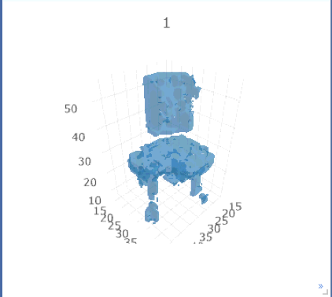
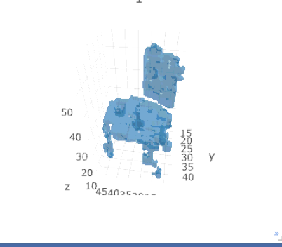

# Generating 3D object
This is a project that generating 3d objects using similar architecture from [3D gan](http://3dgan.csail.mit.edu/papers/3dgan_nips.pdf), but with some change in parameters and also the layers dimension
## How to use
1. Make sure tensorflow is installed
2. Download data from shapenet
3. Modify the path in load_data.py to the correct training images
4. run `python train_3dgan.py`

## Results

